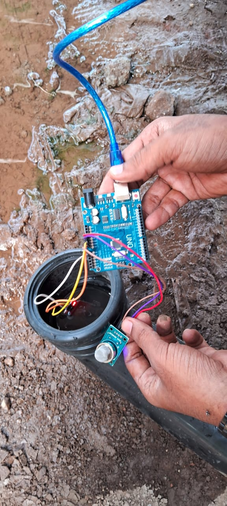
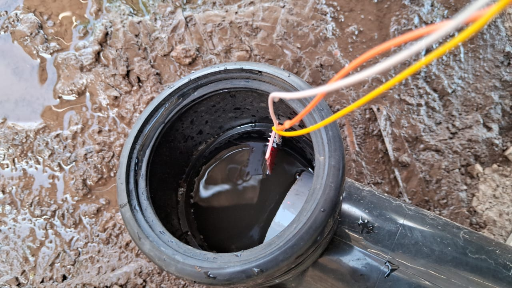
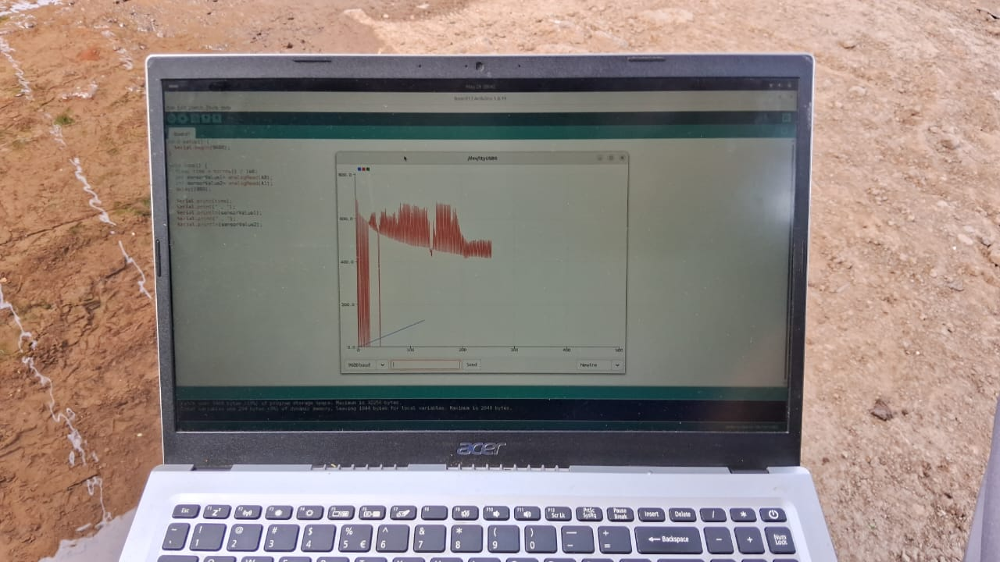
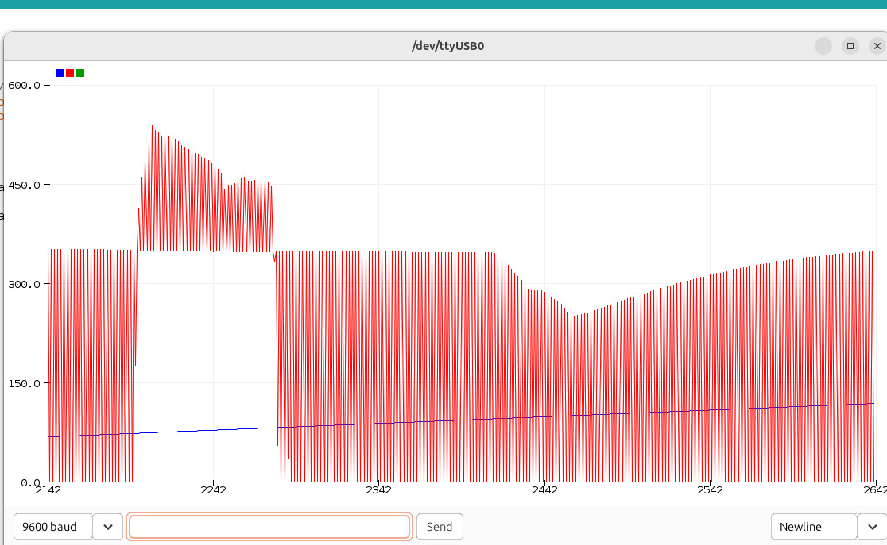
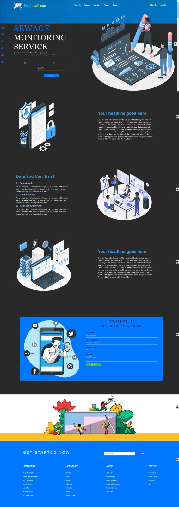

# EcoAquaClean-Real-Time-Sewage-Management-System-

The Real-Time Sewage Management System is designed to monitor and manage sewage conditions through real-time data collection using Tobodo Sen water level sensor, Arduino, and Tobodo Sen MQ air quality sensor. By utilizing advanced machine learning techniques for data analysis and a secure cloud architecture for data management, the system provides valuable insights for effective sewage management. Developed with Node.js and React.js, it features a user-friendly interface for interactive data visualization.

## Practical Implementation
I have conducted practical sessions to implement this system, capturing real-time data using sensors and processing it for meaningful insights. Below are the images from the practical sessions:

  
  

  
  

## Sensors Used
- **Tobodo Sen Water Level Sensor**: For monitoring water levels.
- **Arduino**: For interfacing and data collection.
- **Tobodo Sen MQ Air Quality Sensor**: For measuring methane levels and air quality.

## Tools and Technologies
- **Backend**: Node.js
- **Frontend**: React.js
- **Database**: MongoDB
- **Machine Learning**: Advanced techniques for data analysis
- **Others**: D3.js, CSS3, JavaScript

## Application
This system provides real-time monitoring and data visualization for sewage management. It helps in identifying potential issues by analyzing sensor data, ensuring proactive measures can be taken to prevent any adverse impacts. The interactive dashboard offers a user-friendly interface to visualize data trends and make informed decisions.

  

